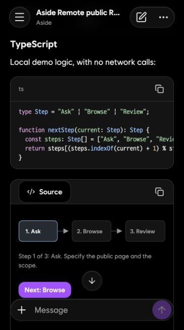
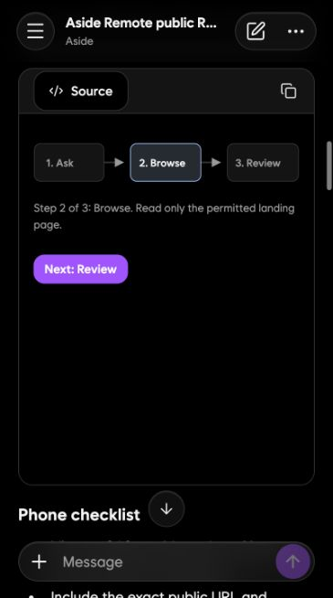
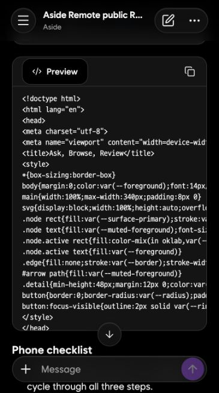
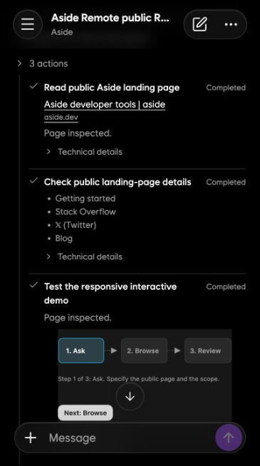
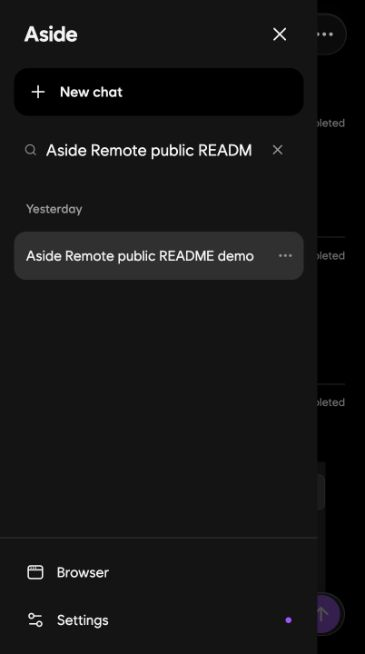
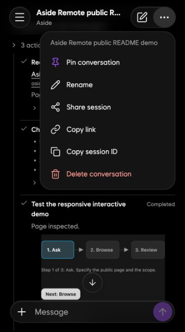
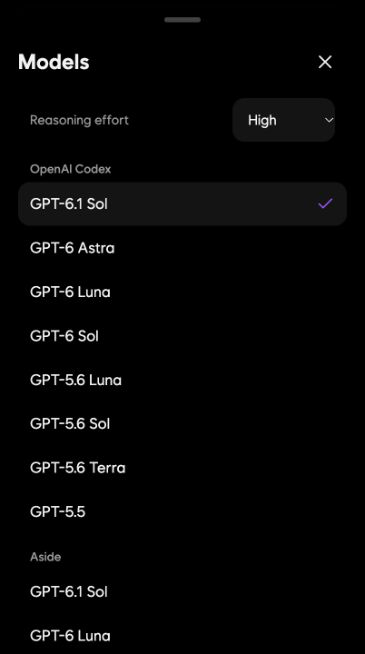
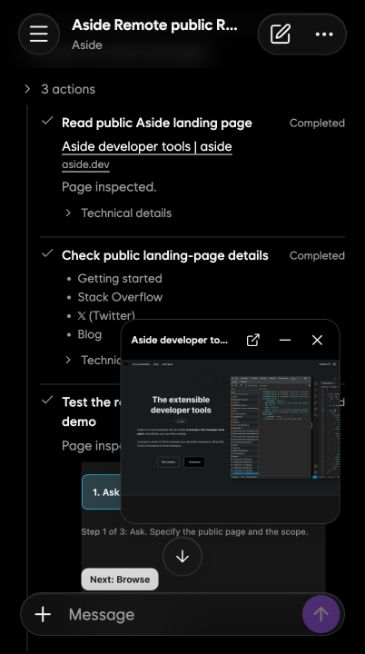
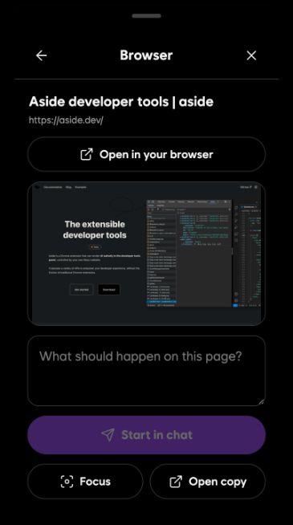
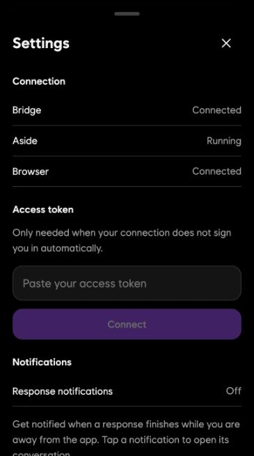

# aside-remote

Use [Aside](https://aside.dev) from your phone or browser. This self-hosted web app
connects to the Aside app and CLI on your Mac, with live conversations, browser
previews, interactive HTML visuals, and completion notifications.

**Cloudflare and Cloudflare Access are optional.** You can use localhost,
Tailscale, your own VPN, or an HTTPS address on your own domain. The bridge has
its own access-token login; no separate AI API key is required.

## Screenshots

Actual app-only captures from a public demo conversation, using a phone-sized browser.
Device status bars and browser address bars are omitted. The demo opens a public page,
runs browser tools, renders an interactive HTML diagram, and accepts a queued message
through **Steer instead**.
Click any image to view it at full size.

<table>
  <tr>
    <th>Code and conversation</th>
    <th>Interactive HTML visual</th>
    <th>Visual source</th>
  </tr>
  <tr>
    <td><a href="docs/screenshots/code-response.jpg"></a></td>
    <td><a href="docs/screenshots/visual-preview.jpg"></a></td>
    <td><a href="docs/screenshots/visual-source.jpg"></a></td>
  </tr>
  <tr>
    <th>Tool activity</th>
    <th>Queue and steering</th>
    <th>Edit a queued message</th>
  </tr>
  <tr>
    <td><a href="docs/screenshots/tool-activity.jpg"></a></td>
    <td><a href="docs/screenshots/queue-steering.jpg"></a></td>
    <td><a href="docs/screenshots/queue-edit.jpg"></a></td>
  </tr>
  <tr>
    <th>Conversation drawer</th>
    <th>Conversation menu</th>
    <th>Model picker</th>
  </tr>
  <tr>
    <td><a href="docs/screenshots/conversation-drawer.jpg"></a></td>
    <td><a href="docs/screenshots/conversation-menu.jpg"></a></td>
    <td><a href="docs/screenshots/model-picker.jpg"></a></td>
  </tr>
  <tr>
    <th>Browser picture-in-picture</th>
    <th>Browser sheet</th>
    <th>Connection and notifications</th>
  </tr>
  <tr>
    <td><a href="docs/screenshots/browser-pip.jpg"></a></td>
    <td><a href="docs/screenshots/browser-sheet.jpg"></a></td>
    <td><a href="docs/screenshots/settings.jpg"></a></td>
  </tr>
</table>

## Setup guide

- [Choose a hosting route](#choose-a-hosting-route)
- [Install and test on the Mac](#install-and-test-on-the-mac)
- [Authentication](#authentication)
- [Start automatically at login](#start-automatically-at-login)
- [Tailscale: private HTTPS](#tailscale-private-https)
- [Your domain: Caddy](#your-domain-caddy)
- [Your domain: Nginx](#your-domain-nginx)
- [Existing website or VPS](#existing-website-or-vps)
- [LAN or your own VPN](#lan-or-your-own-vpn)
- [Tailscale Funnel: public HTTPS](#tailscale-funnel-public-https)
- [Cloudflare Tunnel and Access: optional](#cloudflare-tunnel-and-access-optional)
- [iPhone installation and notifications](#iphone-installation-and-notifications)
- [Configuration reference](#configuration-reference)
- [Updates, backup, and removal](#updates-backup-and-removal)
- [Troubleshooting](#troubleshooting)
- [Deployment acceptance checks](#deployment-acceptance-checks)
- [Development and architecture](#development-and-architecture)

## Features

- Live streamed responses, searchable and virtualized history, Markdown,
  compact D2Coding code blocks, linked citations, and expandable tool activity.
- Interactive HTML visuals with preview/source switching and image attachments.
- Model, provider, and reasoning-effort selection.
- Follow-up queue with **Edit message**, **Steer instead**, and **Cancel message**.
  Stopping a response pauses its queue until resumed.
- Automatically updated browser tabs, a preview sheet, and a draggable PiP that
  remembers its position. Previews can be expanded, zoomed, panned, and dismissed
  with a gesture; pages can also open in your own browser.
- Pin, rename, share, delete, and copy conversation links or session IDs.
  Pins appear first; other conversations sort by their latest activity.
- Conversation deep links, last-conversation restoration, and notifications that
  open the matching conversation.
- Light/dark mode, Wanted Sans, an anchored multiline composer, and mobile
  sheet/drawer transitions. The UI is English; messages keep their own language.
- Web Push completion alerts containing the actual answer preview when the device
  is away from the app. Optional ntfy completion alerts are also available.

[DESIGN.md](DESIGN.md) describes the interface and responsive behavior.

## Choose a hosting route

The **bridge and Aside run together on a Mac**. A VPS, NAS, or existing website can
provide the HTTPS front end, but it must forward requests to that Mac. Uploading
only `web/dist` to a static host does not provide conversations, agent execution,
browser tools, WebSockets, or push delivery.

```text
phone / browser
    │ HTTPS + WSS
    ▼
Tailscale Serve, Caddy, Nginx, or another HTTPS proxy
    │ private connection
    ▼
Mac: aside-remote :8799 → Aside CLI / local daemon / browser profile
```

| Route | Address | Requirements | Login |
| --- | --- | --- | --- |
| Local Mac | `http://127.0.0.1:8799` | Mac only | Automatic on loopback |
| Tailscale Serve — recommended for personal use | `https://mac-name.tailnet-name.ts.net` | Tailscale on Mac and phone; same tailnet | Paste bridge token once per browser/app |
| Own domain, Caddy or Nginx | `https://chat.example.com` | Domain, trusted TLS certificate, reachable proxy | Paste bridge token |
| Existing VPS + Mac | Your domain | HTTPS proxy plus Tailscale or SSH connection to Mac | Paste bridge token |
| LAN / WireGuard / another VPN | Private HTTPS hostname or IP | Private network plus a certificate trusted by each device | Paste bridge token |
| Tailscale Funnel | Public `https://…ts.net` | Funnel enabled; local proxy protecting token bootstrap | Paste bridge token |
| Cloudflare Tunnel + Access | Your domain | Cloudflare domain, tunnel, Access policy | Automatic after verified Access login |

For remote use, choose **HTTPS**, even over a VPN. Browser secure-context APIs,
Web Push, and service workers depend on it. Plain `http://192.168.…:8799` or
`http://100.…:8799` is not the phone-installation path described here.

Before installing, identify these values. Replace example addresses and paths
throughout the selected recipe; do not copy placeholder credentials literally.

| Input | Default / decision |
| --- | --- |
| Mac user | The signed-in macOS user who owns the Aside account and browser profile |
| Checkout | A permanent directory, such as `~/projects/aside-remote` |
| Aside CLI | `~/.local/bin/aside`, or the actual absolute executable path |
| Aside account | `u0`; use the account that owns the intended browser profile |
| Aside user directory | `u0` → `~/.aside/u/0`; `u1` → `~/.aside/u/1` |
| Bridge listener | `127.0.0.1:8799`; keep it private when using a local proxy |
| Remote address | One stable HTTPS origin at `/`, preferably a dedicated subdomain |
| Access route | Private Tailscale/VPN, or a public domain with bridge-token login |
| Notifications | Optional; iPhone needs the HTTPS Home Screen app |

On an existing installation, preserve its token and state, and edit only the
settings needed for the chosen route. Check existing proxy/Serve configuration
before assigning a hostname or port already used by another application.

## Install and test on the Mac

### 1. Prerequisites

- macOS, with the [Aside app](https://aside.dev) installed and signed in.
- Aside CLI installed and authenticated for the same account as the browser profile.
- Python **3.11 or later**. The bridge uses `asyncio.timeout`; the WebSocket
  dependency also requires 3.11+. The setup wizard's older 3.10 check is insufficient.
- Node.js **22.22.2+ on 22.x, 24.15.0+ on 24.x, or 26+**, plus npm. These minimums
  include the test dependencies in the lockfile. Node is needed for builds/tests;
  the built app runs with Python and Aside.
- Git. If macOS offers to install Command Line Tools when running `git`, complete
  that installation first.

With [Homebrew](https://brew.sh) already installed, one option is:

```bash
brew install python@3.13 node@24
export PATH="$(brew --prefix node@24)/bin:$PATH"
python3.13 --version
node --version
npm --version
```

Use a compatible Python from another installer if preferred. Replace
`python3.13` in the next command with that interpreter. Do not install Python
packages into macOS's system Python.

### 2. Check Aside first

Open Aside, sign in, and open its browser profile for the account you intend to
use. On a standard install:

```bash
open -a Aside
~/.local/bin/aside --version
~/.local/bin/aside account list
~/.local/bin/aside --account u0 --host local session list
curl --fail --silent --show-error http://127.0.0.1:21420/health
```

Account/session output can include personal information; keep it out of public
logs. If the CLI is not authenticated, run `~/.local/bin/aside login` and select
the intended account. If its path differs, use that path in these commands and
set `ASIDE_BIN` below.

A reachable daemon alone does not prove that the browser profile is connected.
The Browser check in the web app and an actual browser task are the final tests.
Keep Aside and that profile running under the same logged-in Mac user.

### 3. Clone, isolate dependencies, and build

```bash
mkdir -p "$HOME/projects"
cd "$HOME/projects"
git clone https://github.com/mym0404/aside-remote.git
cd aside-remote
python3.13 -m venv .venv
.venv/bin/python -m pip install --upgrade pip
.venv/bin/python -m pip install -r requirements.txt
npm ci
npm run build
```

`npm run build` checks TypeScript and generates `web/dist`. Keep this checkout at
its permanent path before installing the login service.

### 4. Configure

For a fresh install with standard paths, run:

```bash
.venv/bin/python scripts/setup.py --yes
```

This checks prerequisites, creates the access token, and writes
`~/.aside-remote/env`. On a fresh installation it does not enable Cloudflare,
ntfy, or the login service. Existing settings are preserved, so `--yes` does
**not** remove an older Cloudflare configuration.

The interactive wizard is also available:

```bash
.venv/bin/python scripts/setup.py
```

For Tailscale or your own domain, answer **no** to its Cloudflare question. Its
ntfy question is separate from built-in Web Push, which needs no ntfy service.
Answer no to service installation until the foreground test below passes.

For manual setup, first create its directory with `mkdir -p "$HOME/.aside-remote"`.
Then create/edit `~/.aside-remote/env` with the following values, or edit an
existing configuration to choose a different account. A config file is optional
with all defaults; the server generates a missing token itself.

```dotenv
ASIDE_REMOTE_HOST=127.0.0.1
ASIDE_REMOTE_PORT=8799
ASIDE_BIN=~/.local/bin/aside
ASIDE_ACCOUNT=u0
ASIDE_USER_DIR=~/.aside/u/0
ASIDE_DAEMON_URL=http://127.0.0.1:21420
```

For an existing installation switching away from Access, set these entries empty
in that file and remove conflicting values from the process environment:

```dotenv
ASIDE_REMOTE_ACCESS_TEAM=
ASIDE_REMOTE_ACCESS_AUD=
ASIDE_REMOTE_ACCESS_EMAILS=
ASIDE_REMOTE_ACCESS_CNS=
```

Keep `ASIDE_ACCOUNT` and `ASIDE_USER_DIR` consistent. For example, change both to
`u1` and `~/.aside/u/1`. Protect the configuration:

```bash
chmod 600 "$HOME/.aside-remote/env"
```

File precedence and the complete settings table are in
[Configuration reference](#configuration-reference).

### 5. Run and verify locally

From the checkout:

```bash
.venv/bin/python server.py
```

Keep that terminal running. Open `http://127.0.0.1:8799` on the **same Mac**.
Local login is automatic. In another terminal:

```bash
curl --fail --silent --show-error http://127.0.0.1:8799/ > /dev/null
lsof -nP -iTCP:8799 -sTCP:LISTEN
```

In the app, check **Settings → Connection**: Bridge should be Connected, Aside
Running, and Browser Connected. Start a new chat, send a short prompt, and check
that a streamed answer appears. Ask it to open `https://example.com`, then check
the browser preview. A successful HTML page or health response alone does not
establish that chat and browser actions work.

Stop the foreground server with Ctrl-C before installing the login service.
Use a **single bridge process**; do not add multiple Uvicorn/Gunicorn workers.
Run state, WebSocket subscribers, and browser-process coordination live in that
process.

## Authentication

The bridge creates a random token in `~/.aside-remote/token` with mode `0600` if
none exists. It is a shared credential granting access to the connected Aside
account, including agent execution and its logged-in browser. Share it only with
people/devices you intend to give that access.

For Tailscale, your own domain, LAN/VPN, or Funnel:

1. On the Mac, copy the token without printing it into terminal output:

   ```bash
   pbcopy < "$HOME/.aside-remote/token"
   ```

2. Transfer it through a private channel to the phone if clipboard sharing is not
   available. Open the final HTTPS address.
3. Open **Settings → Access token**, paste it, and press **Connect**.
4. Bridge and Browser should connect; the conversation drawer should load.

Repeat once for each separate browser, Home Screen app, or new origin. The UI
stores the token in that origin's local storage and exchanges it for the
HttpOnly `ar_token` cookie used by images and WebSockets. The cookie lasts 30
days; saved-token login can renew it. Do not put tokens in URLs or screenshots.
If using `ASIDE_REMOTE_TOKEN` or a custom token file, copy that configured token
instead of the default file.

Automatic `/api/web-token` login has only two paths: requests whose host **and**
client are loopback, or a cryptographically verified Cloudflare Access JWT.
Tailscale identity headers, VPN membership, generic SSO headers, and HTTP Basic
Auth do not trigger automatic bridge login. Tailscale/VPN access control and the
bridge token are separate checks, not independent multi-factor authentication.

For a custom proxy:

- Preserve the public `Host`, forward the HTTPS scheme, and forward `/ws` as a
  WebSocket. Keep frontend and API on the same origin.
- In non-Cloudflare public proxies, deny `/api/web-token` as in the recipes below.
  Rewriting both the host and client to loopback could otherwise activate local
  token issuance. A remote unauthenticated request must never return a token.
- Preserve `Authorization` and cookies. HTTP Basic Auth on the same proxy can
  conflict with the app's `Authorization: Bearer …` requests; it is not a
  drop-in login configuration for this app.
- Serve at `/`, not a prefix such as `/aside`. The app uses absolute API, asset,
  service-worker, and manifest paths.
- Trust forwarded headers only from the actual proxy. Uvicorn defaults to
  loopback proxy peers. For a proxy connecting directly from another machine,
  set `FORWARDED_ALLOW_IPS` to its exact private IP, never a public wildcard.

Conversation, browser-action, and upload APIs require the token. The static UI
and `/api/health` diagnostic endpoint are public; the latter includes operational
metadata. Use a private network or a front-door login if you also need to hide
that metadata. This is a personal bridge for one configured Aside account,
without separate user roles or per-user tokens.

## Start automatically at login

After the foreground test passes, from the permanent checkout:

```bash
.venv/bin/python scripts/setup.py --install-service
plutil -lint "$HOME/Library/LaunchAgents/com.aside-remote.plist"
launchctl print "gui/$(id -u)/com.aside-remote"
```

Invoking the installer with `.venv/bin/python` records that interpreter in
`~/Library/LaunchAgents/com.aside-remote.plist`. `--install-service` installs the
service only; it does not install dependencies or perform the setup checks.
The LaunchAgent starts at login and restarts after an unsuccessful exit. It runs
as your user, not root, and loads the configuration file on each server start.

Restart after a configuration edit, inspect logs, or remove the service:

```bash
launchctl kickstart -k "gui/$(id -u)/com.aside-remote"
tail -n 80 logs/bridge.err.log
tail -n 80 logs/bridge.out.log
# Remove only the bridge login service; configuration and conversations remain.
.venv/bin/python scripts/setup.py --uninstall-service
```

Keep Aside and your network/proxy app enabled at login too. A running bridge
cannot replace a disconnected browser profile. The Mac must remain awake and
online; a login LaunchAgent does not provide browser access before user login
or after logout. For a temporary foreground test, `caffeinate -i` prevents idle
system sleep until Ctrl-C. Closed-lid behavior still depends on the Mac's power
and display setup. Screen lock, system sleep, and browser-profile connectivity
are different conditions.

If you move the checkout or replace its virtual environment, rerun the service
installer with the new `.venv/bin/python` path.

## Tailscale: private HTTPS

This route needs no public domain, router forwarding, or Cloudflare.
[Serve](https://tailscale.com/docs/features/tailscale-serve) gives a private HTTPS
address accessible to permitted devices in your tailnet.

1. Install Tailscale on the Mac and phone. Sign both into the same tailnet and
   enable the connection on both. On macOS, use the app's CLI integration.
   If `tailscale` is unavailable, use the bundled CLI:

   ```bash
   export TAILSCALE_BE_CLI=1
   alias tailscale="/Applications/Tailscale.app/Contents/MacOS/Tailscale"
   ```

   See the [macOS CLI instructions](https://tailscale.com/docs/reference/tailscale-cli?tab=macos).
2. Leave the bridge on `127.0.0.1:8799`. Confirm it works locally first.
3. Inspect existing sharing, then create a dedicated HTTPS listener:

   ```bash
   tailscale status
   tailscale serve status
   tailscale serve --bg --https=443 http://127.0.0.1:8799
   tailscale serve status
   ```

4. Follow the command's HTTPS-enablement link if prompted. Open the exact
   `https://…ts.net` URL it prints on the phone with Tailscale connected.
5. Paste the bridge token using [Authentication](#authentication). A 401 from
   `/api/web-token` before token login is expected on this route.
6. Check chat and browser previews over cellular as well as Wi-Fi. Restrict
   access in the tailnet policy to the intended users/devices and serving port.

If port 443 is already assigned to another Serve application, choose a free
HTTPS port, for example `--https=8443`, and use the printed URL including its
port. Do not mount this app at `--set-path=/aside`.

The `--bg` setting persists across Tailscale restarts. Stop only this listener
with the corresponding flags; avoid `serve reset`, which clears other sharing:

```bash
tailscale serve --bg --https=443 off
```

Commands and persistence are documented in the
[Serve CLI reference](https://tailscale.com/docs/reference/tailscale-cli/serve).
Keep this listener private; Funnel changes who can reach it.

## Your domain: Caddy

Use a dedicated hostname, such as `chat.example.com`, with any DNS provider.
The HTTPS proxy can run on the Mac or on a VPS with a private connection to it.
For direct hosting on the Mac:

1. Give the Mac a stable LAN address. Point the hostname's A record to your public
   IPv4 address. Add an AAAA record only if IPv6 actually reaches the same proxy.
   Use dynamic DNS if your public address changes.
2. Forward router TCP ports 80 and 443 to **Caddy**, allow those ports through the
   firewall, and leave the bridge port 8799 unforwarded. If the ISP uses CGNAT or
   blocks inbound access, use Tailscale or the VPS route instead.
3. Install Caddy on the Mac:

   ```bash
   brew install caddy
   ```

4. Add the following site block to `$(brew --prefix)/etc/Caddyfile`, replacing
   `chat.example.com`. Preserve any existing site blocks.

   ```caddyfile
   chat.example.com {
       @bootstrap path /api/web-token
       respond @bootstrap 403
       reverse_proxy 127.0.0.1:8799 {
           header_up Host {hostport}
           header_up X-Forwarded-Proto {scheme}
       }
   }
   ```

5. Validate and start the Homebrew login service:

   ```bash
   caddy validate --config "$(brew --prefix)/etc/Caddyfile" --adapter caddyfile
   brew services start caddy
   brew services info caddy
   ```

   If Caddy already runs, apply the edited configuration with
   `caddy reload --config "$(brew --prefix)/etc/Caddyfile" --adapter caddyfile`.
6. Open `https://chat.example.com`, paste the bridge token, and perform the
   [acceptance checks](#deployment-acceptance-checks) from another network.

Caddy handles [WebSocket upgrades and proxy headers](https://caddyserver.com/docs/caddyfile/directives/reverse_proxy).
Its certificate storage must persist and be
writable by the service user. For this Homebrew service, the data directory is
under `$(brew --prefix)/var/lib`; retain it during updates.
[Homebrew service details](https://formulae.brew.sh/formula/caddy).
[Automatic HTTPS requirements](https://caddyserver.com/docs/automatic-https)
cover DNS, reachable validation ports, and certificate renewal.

For a Debian/Ubuntu VPS, install Caddy using its official repository:

```bash
sudo apt-get update
sudo apt-get install -y debian-keyring debian-archive-keyring apt-transport-https curl gnupg
curl -1sLf 'https://dl.cloudsmith.io/public/caddy/stable/gpg.key' | sudo gpg --dearmor -o /usr/share/keyrings/caddy-stable-archive-keyring.gpg
curl -1sLf 'https://dl.cloudsmith.io/public/caddy/stable/debian.deb.txt' | sudo tee /etc/apt/sources.list.d/caddy-stable.list
sudo chmod o+r /usr/share/keyrings/caddy-stable-archive-keyring.gpg
sudo chmod o+r /etc/apt/sources.list.d/caddy-stable.list
sudo apt-get update
sudo apt-get install caddy
```

Add the site to `/etc/caddy/Caddyfile`, choose its Mac upstream as described in
[Existing website or VPS](#existing-website-or-vps), then run:

```bash
sudo caddy validate --config /etc/caddy/Caddyfile --adapter caddyfile
sudo systemctl reload caddy
sudo systemctl status caddy --no-pager
```

Installation commands: [Caddy packages](https://caddyserver.com/docs/install).
Do not run a second proxy on ports already owned by your existing web server.

## Your domain: Nginx

If you already have an HTTPS Nginx site, keep its certificate configuration and
add the proxy directives below to a dedicated hostname. The example assumes
Nginx and the bridge are on the same Mac, or an SSH tunnel exposes the Mac on the
proxy's loopback interface. For another upstream, replace the address accordingly.

For a fresh Debian/Ubuntu proxy, first point DNS to it, open TCP 80/443, and install:

```bash
sudo apt-get update
sudo apt-get install nginx certbot python3-certbot-nginx
sudo mkdir -p /var/www/aside-acme
```

Create `/etc/nginx/sites-available/aside-remote` with this temporary HTTP site
for certificate issuance:

```nginx
server {
    listen 80;
    server_name chat.example.com;
    location /.well-known/acme-challenge/ { root /var/www/aside-acme; }
    location / { return 404; }
}
```

For this new site only, enable it, validate, obtain the certificate, and then
replace the temporary file with the final configuration below:

```bash
sudo ln -s /etc/nginx/sites-available/aside-remote /etc/nginx/sites-enabled/aside-remote
sudo nginx -t
sudo systemctl reload nginx
sudo certbot certonly --webroot -w /var/www/aside-acme -d chat.example.com
```

Final configuration; replace every `chat.example.com`, including certificate paths.
Use the paths printed by Certbot if the certificate name has an added suffix:

```nginx
# At http context, outside server blocks; define this map only once.
map $http_upgrade $aside_connection_upgrade {
    default upgrade;
    '' close;
}

server {
    listen 80;
    server_name chat.example.com;
    location /.well-known/acme-challenge/ { root /var/www/aside-acme; }
    location / { return 301 https://$host$request_uri; }
}

server {
    listen 443 ssl;
    server_name chat.example.com;
    ssl_certificate /etc/letsencrypt/live/chat.example.com/fullchain.pem;
    ssl_certificate_key /etc/letsencrypt/live/chat.example.com/privkey.pem;
    client_max_body_size 26m;

    location = /api/web-token { return 403; }
    location / {
        proxy_pass http://127.0.0.1:8799;
        proxy_http_version 1.1;
        proxy_set_header Host $http_host;
        proxy_set_header X-Forwarded-Proto $scheme;
        proxy_set_header X-Forwarded-For $proxy_add_x_forwarded_for;
        proxy_set_header Upgrade $http_upgrade;
        proxy_set_header Connection $aside_connection_upgrade;
        proxy_read_timeout 3600s;
        proxy_buffering off;
    }
}
```

On Debian/Ubuntu, `sites-enabled` is included within `http`, so the map above can
remain in the site file. In another layout, put it in the main `http` context.
The 26 MiB proxy allowance accommodates the default 24 MiB file limit and
multipart overhead; increase both limits together if changing uploads.

```bash
sudo nginx -t
sudo systemctl reload nginx
sudo certbot renew --dry-run
```

Ensure successful renewals reload Nginx to load the new certificate. For the
Debian/Ubuntu paths above, create an executable deploy hook at
`/etc/letsencrypt/renewal-hooks/deploy/reload-nginx.sh` containing:

```sh
#!/bin/sh
/usr/sbin/nginx -t && /usr/bin/systemctl reload nginx
```

For these package paths, make the saved hook executable and enable/check renewal:

```bash
sudo chmod 755 /etc/letsencrypt/renewal-hooks/deploy/reload-nginx.sh
sudo systemctl enable --now certbot.timer
sudo systemctl list-timers certbot.timer
sudo certbot renew --dry-run --run-deploy-hooks
```

If your Certbot installer uses a differently named timer or cron job, verify
that scheduler instead. These Nginx examples listen on IPv4. If publishing an
AAAA record, also add `listen [::]:80;` and `listen [::]:443 ssl;` to the
corresponding server blocks and verify IPv6 reachability. Open the HTTPS address,
paste the token, and test streamed replies and browser images. Explicit upgrade headers
are required for [Nginx WebSocket proxying](https://nginx.org/en/docs/http/websocket.html).
[Certbot's Nginx/Webroot documentation](https://eff-certbot.readthedocs.io/en/stable/using.html)
explains certificate issuance and renewal hooks.

## Existing website or VPS

Keep your current website and add a dedicated subdomain for Aside Remote.
Proxy the **entire** subdomain, including `/api/*`, `/ws`, `/assets/*`, `/sw.js`,
`/manifest.webmanifest`, `/icons/*`, and `/c/<session>` routes. Do not cache API,
authentication, HTML entry pages, or WebSocket traffic. Keep the application's
cache headers for hashed assets. Generic static hosting alone cannot run this
Mac bridge.

There are two ways to connect a remote proxy to the Mac without exposing 8799
on the public Internet.

### Option A: VPS reaches the Mac through Tailscale

Install Tailscale on the VPS and Mac in the same tailnet. On a Linux VPS without
an existing Tailscale installation, the official installer and login are:

```bash
curl -fsSL https://tailscale.com/install.sh | sh
sudo tailscale up
```

Follow the login URL to join the intended tailnet.
[Linux installation instructions](https://tailscale.com/docs/install/linux).
Complete the Mac's private Serve recipe first. Permit the VPS to reach that Mac's Serve port in the
tailnet policy. From the VPS, an unauthenticated `/api/sessions` request to the
Mac's Serve URL should return 401, proving the private path is reachable.

For Caddy on the VPS, use this site instead of the loopback upstream:

```caddyfile
chat.example.com {
    @bootstrap path /api/web-token
    respond @bootstrap 403
    reverse_proxy https://mac-name.tailnet-name.ts.net {
        header_up Host {hostport}
        header_up X-Forwarded-Proto https
    }
}
```

Replace the upstream with the actual Serve URL, including its port if not 443.
Caddy uses that hostname
for TLS validation while preserving the public Host explicitly. Keep upstream
certificate verification enabled. The phone now needs only the public HTTPS
address and bridge token; Tailscale is needed on the **VPS and Mac** for this
route. The Mac and Serve listener must remain online.

### Option B: Mac creates an SSH reverse tunnel to the VPS

Use a VPS account that permits TCP forwarding. Verify the server's host-key
fingerprint through your VPS provider before accepting the first SSH connection.
If you do not already have a suitable key, create a dedicated one on the Mac
(do not overwrite an existing key), and install only its public key on the VPS:

```bash
ssh-keygen -t ed25519 -f "$HOME/.ssh/aside-remote-vps"
cat "$HOME/.ssh/aside-remote-vps.pub" | ssh bridge-user@vps.example.com 'umask 077; mkdir -p ~/.ssh; cat >> ~/.ssh/authorized_keys'
ssh-add --apple-use-keychain "$HOME/.ssh/aside-remote-vps"
```

Keep the private key on the Mac. To test the forwarding connection:

```bash
ssh -N -T \
  -i "$HOME/.ssh/aside-remote-vps" \
  -o ExitOnForwardFailure=yes \
  -o ServerAliveInterval=30 \
  -o ServerAliveCountMax=3 \
  -R 127.0.0.1:18799:127.0.0.1:8799 bridge-user@vps.example.com
```

Leave it running during the initial test. The VPS now has a **loopback-only**
port 18799 forwarding to the Mac bridge. In the Caddy/Nginx public-domain recipe,
use `127.0.0.1:18799` as the upstream instead of port 8799. Keep the bootstrap
block and public Host. Permit public 80/443 and SSH as required; do not publish
18799 or turn on wildcard `GatewayPorts`.

For automatic reconnection at Mac login, add a dedicated entry to `~/.ssh/config`:

```sshconfig
Host aside-remote-vps
    HostName vps.example.com
    User bridge-user
    IdentityFile ~/.ssh/aside-remote-vps
    IdentitiesOnly yes
    UseKeychain yes
    AddKeysToAgent yes
    BatchMode yes
    ExitOnForwardFailure yes
    ServerAliveInterval 30
    ServerAliveCountMax 3
    RemoteForward 127.0.0.1:18799 127.0.0.1:8799
```

Use the actual private-key path. Test `ssh -N -T aside-remote-vps` interactively
first so host-key verification is complete. Then stop that test and save this
as `~/Library/LaunchAgents/com.aside-remote.ssh.plist`, replacing the log paths
with your **absolute** home path; plist strings do not expand `~`:

```xml
<?xml version="1.0" encoding="UTF-8"?>
<!DOCTYPE plist PUBLIC "-//Apple//DTD PLIST 1.0//EN" "http://www.apple.com/DTDs/PropertyList-1.0.dtd">
<plist version="1.0"><dict>
  <key>Label</key><string>com.aside-remote.ssh</string>
  <key>ProgramArguments</key><array>
    <string>/usr/bin/ssh</string><string>-N</string><string>-T</string>
    <string>aside-remote-vps</string>
  </array>
  <key>RunAtLoad</key><true/>
  <key>KeepAlive</key><true/>
  <key>ThrottleInterval</key><integer>10</integer>
  <key>StandardOutPath</key><string>/Users/YOUR_USER/.aside-remote/ssh.out.log</string>
  <key>StandardErrorPath</key><string>/Users/YOUR_USER/.aside-remote/ssh.err.log</string>
</dict></plist>
```

```bash
plutil -lint "$HOME/Library/LaunchAgents/com.aside-remote.ssh.plist"
launchctl bootstrap "gui/$(id -u)" "$HOME/Library/LaunchAgents/com.aside-remote.ssh.plist"
```

The SSH connection's keepalives detect failure; launchd restarts the process.
Check that the remote listening port is still loopback-only and that the HTTPS
app reconnects after a tunnel restart. SSH forwarding semantics are in the
[OpenSSH manual](https://man.openbsd.org/ssh#R).

## LAN or your own VPN

You can use WireGuard, a router VPN, or another private network without Tailscale
or Cloudflare. The recipe still needs an HTTPS name/address trusted by the phone:

- Put Caddy/Nginx on the Mac or a reachable private proxy.
- Make private DNS resolve the chosen name to that proxy.
- Use the public-domain TLS recipe if you already have a certificate for that
  name. A DNS-based ACME challenge can issue certificates without opening the
  private service publicly; its plugin/credentials depend on your DNS provider.
- Keep the bridge on loopback when the proxy runs on the Mac. If a separate LAN
  proxy must connect directly, bind `ASIDE_REMOTE_HOST` to the Mac's specific
  LAN/VPN address, allow only the proxy through the firewall, and set
  `FORWARDED_ALLOW_IPS` to that proxy's exact private address. Use an encrypted
  VPN link for traffic crossing networks. Do not forward that bridge port publicly.

For a LAN-only installation with no domain/certificate provider, Caddy can issue
an internal certificate. Add a local DNS record, for example `aside.home.arpa`,
pointing to the Mac's stable LAN IP, then use this Caddy site:

```caddyfile
aside.home.arpa {
    tls internal
    @bootstrap path /api/web-token
    respond @bootstrap 403
    reverse_proxy 127.0.0.1:8799 {
        header_up Host {hostport}
        header_up X-Forwarded-Proto {scheme}
    }
}
```

Find the **public root certificate** at `pki/authorities/local/root.crt` under
Caddy's data directory. For the Mac Homebrew service this is normally
`$(brew --prefix)/var/lib/caddy/pki/authorities/local/root.crt`; check the running
service's data directory if it differs. Transfer only that certificate to your
own devices, never `root.key` or other private keys.

On iPhone, install the downloaded certificate profile in Settings, then enable
it under **General → About → Certificate Trust Settings → Enable full trust for
root certificates**. Open `https://aside.home.arpa` and confirm there is no TLS
warning before installing the Home Screen app. Each client must trust this CA;
clicking through a certificate warning is not an installation test. Local DNS
must also be reachable through the VPN when away from home.
[Caddy internal TLS](https://caddyserver.com/docs/caddyfile/directives/tls),
[Apple certificate trust instructions](https://support.apple.com/en-us/102390).

## Tailscale Funnel: public HTTPS

Funnel is an alternative when you want an Internet-accessible `…ts.net` URL
without a personal domain. It makes the listener public, unlike private Serve.
Use the bridge token and a local bootstrap-blocking proxy. Do not convert an
existing private listener without checking who will gain access.

Install Caddy and start this separate loopback-only site, either by adding it to
your running Caddyfile or using a dedicated file:

```caddyfile
http://:8798 {
    bind 127.0.0.1
    @bootstrap path /api/web-token
    respond @bootstrap 403
    reverse_proxy 127.0.0.1:8799 {
        header_up Host {hostport}
        header_up X-Forwarded-Proto https
    }
}
```

Use one Caddy instance: if its login service already runs, add this block to its
existing Caddyfile and reload it. Otherwise create the directory with
`mkdir -p "$HOME/.config/aside-remote"`, save the dedicated file below, and test
it in the foreground. Do not start another instance using the same admin port.

For a dedicated file at `~/.config/aside-remote/Funnel.Caddyfile`:

```bash
caddy validate --config "$HOME/.config/aside-remote/Funnel.Caddyfile" --adapter caddyfile
caddy run --config "$HOME/.config/aside-remote/Funnel.Caddyfile" --adapter caddyfile
```

In another terminal, use a free Funnel HTTPS port (8443 here leaves a private
443 Serve listener intact):

```bash
tailscale funnel --bg --https=8443 http://127.0.0.1:8798
tailscale funnel status
```

Enable Funnel through the command's policy prompt if necessary. Open the printed
public URL, paste the token, and verify that an unauthenticated `/api/web-token`
returns 403. Add this Caddy site to the login service configuration for continued
use; the dedicated foreground command alone stops when its process exits.
To remove only this Funnel listener:

```bash
tailscale funnel --bg --https=8443 off
```

The `bind` directive keeps port 8798 loopback-only while accepting the forwarded
Funnel hostname. [Caddy binding reference](https://caddyserver.com/docs/caddyfile/directives/bind).
Funnel ports and prerequisites: [Funnel CLI](https://tailscale.com/docs/reference/tailscale-cli/funnel).
For identity-gated public access, place a compatible session-based login in
front, or choose the optional Access route below. Keep the bridge token too.

## Cloudflare Tunnel and Access: optional

Skip this entire section for Tailscale, VPN, or your own-domain token login.
This recipe uses a named, locally managed tunnel so its configuration is visible
on the Mac. Cloudflare also offers dashboard-managed tunnels.

1. Add your domain to Cloudflare and configure its nameservers.
2. Create a **self-hosted Access application** for `chat.example.com` and an
   Allow policy limited to your intended identity/email. Keep it enabled before
   publishing the hostname. Record its application AUD and your Access team
   domain; use the team domain without `https://` or a path. The AUD is available
   in the application configuration; [JWT validation instructions](https://developers.cloudflare.com/cloudflare-one/access-controls/applications/http-apps/authorization-cookie/validating-json/) explain these values.
3. Install and create the tunnel:

   ```bash
   brew install cloudflared
   cloudflared tunnel login
   cloudflared tunnel create aside-remote
   ```

4. Record the generated UUID and credential-file path. Add this to
   `~/.cloudflared/config.yml`, replacing the hostname, UUID, and absolute path:

   ```yaml
   tunnel: YOUR_TUNNEL_UUID
   credentials-file: /Users/YOUR_USER/.cloudflared/YOUR_TUNNEL_UUID.json
   ingress:
     - hostname: chat.example.com
       service: http://127.0.0.1:8799
       originRequest:
         httpHostHeader: chat.example.com
     - service: http_status:404
   ```

5. Add these entries to `~/.aside-remote/env`, then restart the bridge:

   ```dotenv
   ASIDE_REMOTE_ACCESS_TEAM=yourteam.cloudflareaccess.com
   ASIDE_REMOTE_ACCESS_AUD=YOUR_ACCESS_APPLICATION_AUD
   ASIDE_REMOTE_ACCESS_EMAILS=you@example.com
   ```

6. Validate the tunnel, create DNS, and test it in the foreground:

   ```bash
   cloudflared tunnel ingress validate
   cloudflared tunnel route dns aside-remote chat.example.com
   cloudflared tunnel run aside-remote
   ```

7. Open the HTTPS hostname, complete Access login, and check that the bridge
   connects without pasting a token. The bridge verifies the JWT signature,
   issuer, audience, expiry, and configured identity; it does not trust a plain
   email header. Keep `/api/web-token` reachable through the Access-protected
   tunnel, unlike the non-Access proxy recipes.
8. Stop the foreground tunnel after testing and install its user login service:

   ```bash
   cloudflared service install
   ```

The bridge and tunnel are separate services. Protect the tunnel credentials and
configuration with owner-only permissions. No inbound router port forwarding
is needed. Do not use a temporary unauthenticated quick-tunnel URL as a permanent
replacement for this policy.
[Access application setup](https://developers.cloudflare.com/cloudflare-one/access-controls/applications/http-apps/self-hosted-public-app/),
[named-tunnel setup](https://developers.cloudflare.com/tunnel/features/locally-managed-tunnels/create-local-tunnel/),
[macOS tunnel service](https://developers.cloudflare.com/tunnel/features/locally-managed-tunnels/as-a-service/macos/).

## iPhone installation and notifications

1. Finish one HTTPS hosting route. For private Tailscale/VPN, connect the phone
   first. Use the final stable hostname, without certificate warnings.
2. Open it in Safari and connect using the bridge token if prompted.
3. Choose **Share → Add to Home Screen**, then open the installed app. Connect
   again if its storage is separate from Safari's.
4. On **iOS/iPadOS 16.4 or later**, choose **Settings → Notifications → Enable
   notifications** in that Home Screen app and allow the system prompt. Permission
   must follow this user action; a regular iPhone Safari tab is insufficient.
5. Send a message, switch away from the app before completion, and check the
   notification. It should contain the completed answer preview. Tap it to open
   that conversation and verify that the chat loads inside the app.

The Mac sends encrypted Web Push through the browser's push service. It needs
outbound HTTPS access to that service; the phone does not require an inbound
connection from your Mac to receive the OS alert. Opening a private conversation
still requires the phone's Tailscale/VPN connection and a reachable bridge.
Focused devices suppress completion alerts. Long previews are truncated to fit
the payload; stopping a response does not send a completion alert. Network,
system notification settings, and Focus modes can delay or suppress delivery.

Signing keys and subscriptions are created automatically in
`~/.aside-remote/web-push`; keep them across restarts and backups. No Apple
developer account, APNs certificate, or manually issued VAPID key is required.
Changing the hostname or losing the signing key requires enabling notifications
again for that origin. The service worker handles push; it does not turn the app
into an offline conversation client.
[WebKit's Home Screen Web Push requirements](https://webkit.org/blog/13878/web-push-for-web-apps-on-ios-and-ipados/).

### Optional ntfy

ntfy is independent of Home Screen Web Push. Set a server URL and a unique topic:

```dotenv
ASIDE_REMOTE_NTFY=https://ntfy.sh
ASIDE_REMOTE_NTFY_TOPIC=YOUR_PRIVATE_RANDOM_TOPIC
ASIDE_REMOTE_NTFY_ENABLED=1
```

Restart the bridge and subscribe to the same topic in an ntfy client. Public
topics are not private merely because they have a name; use a high-entropy topic
or your own protected ntfy service. This bridge's ntfy configuration supplies a
URL and topic, without a separate ntfy username/password option.

## Configuration reference

Values resolve in this order, with the first value winning:

1. Actual environment variables of the server process.
2. `~/.aside-remote/env`.
3. The checkout's `.env`.
4. Built-in defaults.

Env files use `KEY=VALUE`, with optional full-line `#` comments. Do not add
`export`, shell commands, or inline comments. Values do not expand `$HOME`,
`$OTHER_VAR`, or command substitutions. For path settings use an absolute path
or `~`, which the bridge expands. An explicitly empty value in the first file
also overrides a later file. Restart after editing.

A terminal's exported settings are not automatically inherited by a login
LaunchAgent. Put persistent bridge settings in `~/.aside-remote/env`. A custom
`FORWARDED_ALLOW_IPS` value can go there too; Uvicorn reads it at startup. The
service sets `HOME`, and absolute Aside/interpreter paths avoid PATH differences.

| Variable | Default | Purpose |
| --- | --- | --- |
| `ASIDE_REMOTE_HOST` | `127.0.0.1` | Bind address; normally leave loopback behind a local proxy |
| `ASIDE_REMOTE_PORT` | `8799` | Bridge port; update the upstream when changing it |
| `ASIDE_REMOTE_TOKEN_FILE` | `~/.aside-remote/token` | Shared token file; generated if absent/empty |
| `ASIDE_REMOTE_TOKEN` | Unset | Explicit token override; takes precedence over the token file |
| `ASIDE_BIN` | `~/.local/bin/aside` | Aside CLI executable |
| `ASIDE_ACCOUNT` | `u0` | CLI account ID; must match its user directory |
| `ASIDE_USER_DIR` | `~/.aside/u/<account number>` | Aside account's sessions and uploads; `u0` uses `0` |
| `ASIDE_DAEMON_URL` | `http://127.0.0.1:21420` | Local Aside daemon |
| `ASIDE_REMOTE_FOLLOWUPS_FILE` | `~/.aside-remote/followups.json` | Persistent queue state |
| `ASIDE_REMOTE_WEB_PUSH_DIR` | `~/.aside-remote/web-push` | Push signing key and subscriptions |
| `ASIDE_REMOTE_UPLOAD_MAX` | `25165824` | Maximum image file size, bytes: 24 MiB |
| `ASIDE_REMOTE_MCP_KEEPALIVE` | `1500` | MCP keepalive interval, seconds |
| `ASIDE_REMOTE_MCP_TIMEOUT` | `125` | Browser REPL call timeout, seconds |
| `ASIDE_REMOTE_SHOT_TTL` | `60` | Screenshot cache lifetime, seconds |
| `ASIDE_REMOTE_NTFY` | Empty | ntfy server URL; empty disables ntfy |
| `ASIDE_REMOTE_NTFY_TOPIC` | `aside-runs` | Completion-alert topic |
| `ASIDE_REMOTE_NTFY_ENABLED` | `1` | ntfy is enabled only with a URL and value `1`; `0` disables |
| `ASIDE_REMOTE_ACCESS_TEAM` | Empty | Optional Access team domain, without scheme |
| `ASIDE_REMOTE_ACCESS_AUD` | Empty | Optional Access application audience tag |
| `ASIDE_REMOTE_ACCESS_EMAILS` | Empty | Comma-separated allowed Access emails; set an explicit allowlist when using Access |
| `ASIDE_REMOTE_CF_SERVICE_TOKEN_FILE` | `~/.aside-remote/cf_service_token.json` | Optional JSON with `client_id`/`client_secret` for a separately configured Access service-token client |
| `ASIDE_REMOTE_ACCESS_CNS` | Empty | Additional allowed Access service-token common names, comma-separated |
| `FORWARDED_ALLOW_IPS` | Uvicorn's loopback default | Exact trusted proxy peer addresses; relevant when a proxy is on another machine |

The service-token file informs bridge identity verification; it does not make
the web UI send Cloudflare service credentials automatically. A separate client
must supply them to Access. Ordinary browser use needs only the email policy.

WebSocket heartbeats are fixed at 20 seconds. Tab-list caching is 5 seconds;
new-session detection and JSONL polling have internal defaults rather than
exposed environment settings. Start with defaults before changing browser timeouts.
[`.env.example`](.env.example) is also provided as a commented template.

## Updates, backup, and removal

### Update

Wait for active runs to finish and pause queued follow-ups before restarting.
From the checkout:

```bash
git status --short
git pull --ff-only
.venv/bin/python -m pip install -r requirements.txt
npm ci
npm run build
npm test
launchctl kickstart -k "gui/$(id -u)/com.aside-remote"
```

Resolve local changes without discarding them before pulling. For a foreground
server, stop and restart it instead of using `launchctl`. If a Python upgrade
replaces the virtual environment, reinstall the login service afterward.
Reload open clients after a build so they use the new asset bundle. Bypass
proxy caching for HTML/API/auth routes; never cache an authentication response.
Keep the Aside app/CLI compatible; `aside update` updates Aside separately from
this repository and can change its internal interfaces.

### Backup and restore

| State | Default location | Preserve? |
| --- | --- | --- |
| Bridge settings and access token | `~/.aside-remote/env`, `~/.aside-remote/token` | Yes; token is a secret |
| Follow-up queue | `~/.aside-remote/followups.json` | Yes; review queued work before resuming |
| Push keys/subscriptions | `~/.aside-remote/web-push/` | Yes; losing the key requires resubscription |
| Conversations and titles | `~/.aside/u/0/sessions/` | Yes; use the configured account's path |
| Image attachments | `~/.aside/u/0/uploads/` | Yes |
| Conversation pins | `<checkout>/cache/conversation-pins.sqlite` | Yes |
| Browser preferences, draft, PiP position | Client origin's browser storage | Device-specific; a new origin has separate state |
| Screenshots/media caches, logs, built UI | `cache/shots`, `cache/media`, `logs`, `web/dist` | Regenerable; not required for restoring conversations |
| Proxy/TLS/tunnel state | Caddy data, certificate files, proxy config, SSH keys, or tunnel credentials | Preserve separately for the chosen route |

For standard paths and account `u0`, stop the bridge after all runs are idle and
copy state to a private backup directory outside the repository:

```bash
.venv/bin/python scripts/setup.py --uninstall-service
umask 077
backup_dir="$HOME/Backups/aside-remote/$(date +%Y%m%d-%H%M%S)"
mkdir -p "$backup_dir"
chmod 700 "$backup_dir"
ditto "$HOME/.aside-remote" "$backup_dir/bridge-state"
ditto "$HOME/.aside/u/0/sessions" "$backup_dir/sessions"
ditto "$HOME/.aside/u/0/uploads" "$backup_dir/uploads"
if [ -f cache/conversation-pins.sqlite ]; then
    ditto cache/conversation-pins.sqlite "$backup_dir/conversation-pins.sqlite"
fi
.venv/bin/python scripts/setup.py --install-service
```

Adjust source paths for custom account/state directories. Stop a foreground
server with Ctrl-C instead of uninstalling/reinstalling a service it never used.
Store backups privately: they contain tokens, messages, images, and subscription
credentials. Backing up bridge state does not transfer Aside's authenticated Mac
login or Keychain credentials to a new Mac.

To restore, first install and sign into Aside on the target Mac, stop the bridge,
then copy each saved directory/file back to the matching location in the table.
Restore only into an empty target or after separately preserving its current
state; `ditto` merges directories, so mixing two queue/session stores is not a
clean restore. Ensure the files belong to the target Mac user and that token,
configuration, and private keys retain owner-only permissions. Install the login
service again, start the selected proxy, and run the acceptance checks. Enable
notifications again if the origin or key changed.

### Rotate the access token

After active runs finish, stop the bridge and replace the configured token file
with a freshly generated credential. For the default token file:

```bash
.venv/bin/python - <<'PYTOKEN'
from pathlib import Path
import secrets
path = Path.home() / ".aside-remote/token"
path.parent.mkdir(parents=True, exist_ok=True)
path.write_text(secrets.token_urlsafe(32) + "\n")
path.chmod(0o600)
PYTOKEN
```

Remove/update any `ASIDE_REMOTE_TOKEN` override or the file change will have no
effect. Restart the bridge; old saved tokens/cookies stop working. Reconnect each
client through Settings, or verified Access login. Never rotate just to install
another client.

### Remove services

```bash
.venv/bin/python scripts/setup.py --uninstall-service
# If the optional SSH LaunchAgent was installed:
launchctl bootout "gui/$(id -u)" "$HOME/Library/LaunchAgents/com.aside-remote.ssh.plist"
```

Remove that SSH plist after bootout. Disable only this app's Serve/Funnel listener
with its original flags, or remove its dedicated proxy site and reload the proxy.
Do not stop a shared proxy or clear all Tailscale routes when other apps use them.
Back up before deleting the checkout or account files; uninstalling the bridge
service alone leaves Aside and conversation data intact.

## Troubleshooting

| Symptom | Check and fix |
| --- | --- |
| `ModuleNotFoundError`, or `asyncio.timeout` missing | Use `.venv/bin/python`; verify Python ≥3.11 and install `requirements.txt` in that environment. The wizard's Python check alone is insufficient. |
| npm engine error | Check `node --version` against the lockfile minimums above; ensure the intended Homebrew Node is first on PATH, then run `npm ci`. |
| HTTP 503 “Web UI is not built” | Run `npm ci` and `npm run build` in this checkout. The server serves `web/dist`, not raw TSX. |
| Address already in use | Inspect `lsof -nP -iTCP:8799 -sTCP:LISTEN`; stop your duplicate foreground process or change port and proxy upstream together. |
| Works in a terminal, fails at login | Check the plist's absolute interpreter path, `ASIDE_BIN`, env-file permissions, and `logs/bridge.err.log`. Login services do not inherit your terminal PATH/exports. |
| Remote UI opens but conversations do not | Paste the correct token in Settings. A private/public proxy is not automatic token login. Verify `/api/auth` and cookie forwarding. |
| `/api/web-token` gives 401/403 without Access | Expected before manual login. Do not “fix” it by making the proxy pretend the request is localhost. |
| Remote `/api/web-token` returns a token without login | Remove public access immediately. Fix Host/client rewriting, add the non-Access bootstrap block, and rotate the exposed token before reopening. |
| Cookie/WebSocket auth fails behind a proxy | Preserve Host, `Authorization`, cookies, and `X-Forwarded-Proto: https`; trust only the actual proxy peer. Check `/ws` returns 101 after login. |
| “Reconnecting…” or responses stop updating | Check WebSocket upgrade headers and idle timeouts. Exclude API/WS from caching; use the Nginx upgrade configuration above. Bridge heartbeat is 20 seconds. |
| Bridge reachable, Browser unavailable | Open Aside and the matching signed-in browser profile. Check account/path alignment and run an actual browser task; daemon health is insufficient. |
| New conversation fails / wrong account's history | Verify `ASIDE_ACCOUNT`, `ASIDE_USER_DIR`, CLI authentication, and selected profile. Do not delete sessions or rotate the bridge token to repair a profile connection. |
| A browser window closes or changes mode | Reopen the intended profile/window in Aside and retry. The bridge can repair some stale bindings, but cannot operate a profile that is unavailable. |
| Domain certificate fails | Check A/AAAA records, external reachability of the proxy on 80/443, CGNAT, other listeners, and writable persistent certificate storage. Remove an incorrect AAAA record. |
| Private Tailscale URL fails | Check both devices' Tailscale connection, HTTPS enablement, tailnet policy, `tailscale serve status`, and local bridge response. Use the full printed HTTPS URL. |
| VPS responds 502 | Test Mac reachability from the VPS. For SSH, check loopback port 18799 and tunnel logs; for Tailscale, check Mac Serve URL and tailnet permissions. |
| Image upload returns 413 | Match proxy body limits to the configured bridge file limit plus multipart overhead. Default Nginx allowance here is 26 MiB. |
| iPhone notification button unavailable | Use HTTPS and open the installed Home Screen app on iOS/iPadOS ≥16.4, not a Safari tab. |
| Notifications never arrive | Check OS permission/Focus, app is unfocused, Mac awake, outbound push connectivity, saved key/subscription, and bridge logs. Test a completed response rather than a stopped run. |
| Notification opens an unavailable conversation | Reconnect private VPN/Tailscale; verify the same origin/token and that the session still exists. |
| Old assets or blank UI after updating | Reload the client, verify current `/assets/*` return 200, and remove HTML/API cache rules in the proxy. If needed close/reopen the Home Screen app. |

Useful checks from the checkout:

```bash
.venv/bin/python --version
node --version
lsof -nP -iTCP:8799 -sTCP:LISTEN
curl --fail --silent --show-error http://127.0.0.1:21420/health
launchctl print "gui/$(id -u)/com.aside-remote"
tail -n 80 logs/bridge.err.log
```

Logs and CLI output can contain local paths and account/session details. Redact
secrets and personal data before sharing diagnostics.

## Deployment acceptance checks

Complete these after installation, a hostname change, or an update. Do not treat
an HTTP 200 from the UI or `/api/health` as the entire test.

| Check | Observable result |
| --- | --- |
| Local build and runtime | `/` loads the built UI; exactly one bridge owns the configured listener |
| Remote origin | Trusted HTTPS loads from the intended phone/network without a TLS warning |
| Unauthenticated access | A fresh browser cannot list conversations; `/api/sessions` returns 401 before bridge login, or the front-door identity policy intercepts it |
| Bootstrap | Non-Access remote `/api/web-token` returns 401/403 and never a token; Access issues one only after its allowed login |
| Login | Settings → Connect loads history and establishes a `/ws` connection; proxy sees status 101 |
| New conversation | One tap sends the draft, clears it, creates a chat, and streams the response |
| Continue and restore | A follow-up reaches the same conversation; reload or `/c/<session>` restores it |
| Queue and steer | During a run, another message queues; its menu can edit, cancel, or steer it immediately |
| Browser | Agent opens a public test page; title, sheet, and PiP preview update; “Open in your browser” opens the URL |
| Content | Code stays within its block; an HTML visual renders; uploaded image opens and can zoom/pan |
| History controls | Pin and rename survive reload; drawer sorts unpinned chats by latest activity |
| Phone layout | Keyboard/send, multiline drafts, anchored header/composer, and long responses do not cause horizontal page overflow |
| Notification | While away from the Home Screen app, a completed reply produces its answer preview; tapping opens that conversation |
| Services | After user login or a controlled service restart, bridge and selected proxy/tunnel recover without a manual terminal |

For a non-Access route, set your final origin and check unauthenticated endpoints
without sending a token:

```bash
app_origin='https://chat.example.com'
curl --silent --show-error --output /dev/null --write-out '%{http_code}\n' "$app_origin/"
curl --silent --show-error --output /dev/null --write-out '%{http_code}\n' "$app_origin/api/sessions"
curl --silent --show-error --output /dev/null --write-out '%{http_code}\n' "$app_origin/api/web-token"
```

Expected codes are `200`, `401`, and `401` or `403`, respectively. Use the browser
for authenticated checks so the token is not pasted into shell history. An
identity gateway may redirect unauthenticated clients instead; verify the
protected app after completing that gateway's login.

## Development and architecture

```bash
npm ci
npm run build
npm test
.venv/bin/python server.py
```

For frontend development, run the backend on port 8800 in one terminal:

```bash
ASIDE_REMOTE_PORT=8800 .venv/bin/python server.py
```

Then run Vite in another terminal:

```bash
npm run dev
```

Open `http://127.0.0.1:5173`. Vite proxies API and WebSocket requests to port 8800.
Use the production build/HTTPS hosting route for Home Screen and push checks.

The frontend uses React, TypeScript, StyleX, React Compiler, and Vite. Source is
in `web/src`; Python serves `web/dist`. Message rendering loads on demand; the
browser panel is included with the app shell.

The bridge uses Aside's installed CLI, a persistent MCP browser REPL, PTY-backed
agent runs, the local daemon, and session files. Intermediate messages stream
from `messages.jsonl` rather than waiting for a final CLI answer. Conversations
are stored under the configured Aside user directory; uploads go there so the
agent can read them within Aside's permitted roots.

These integrations rely on Aside's internal behavior rather than a stable
public server API. The bridge uses the installed signed CLI to authorize daemon
operations and can repair some stale browser bindings. Aside updates can still
change CLI/daemon behavior; recheck new chats, continuation, steering, and
browser previews after updating. Keep the daemon local rather than exposing
port 21420. Treat bridge-token access like access to your logged-in browser and
agent tools, not a read-only chat viewer.

## License

MIT, except bundled third-party assets, which retain the licenses listed in
[NOTICE](NOTICE).
